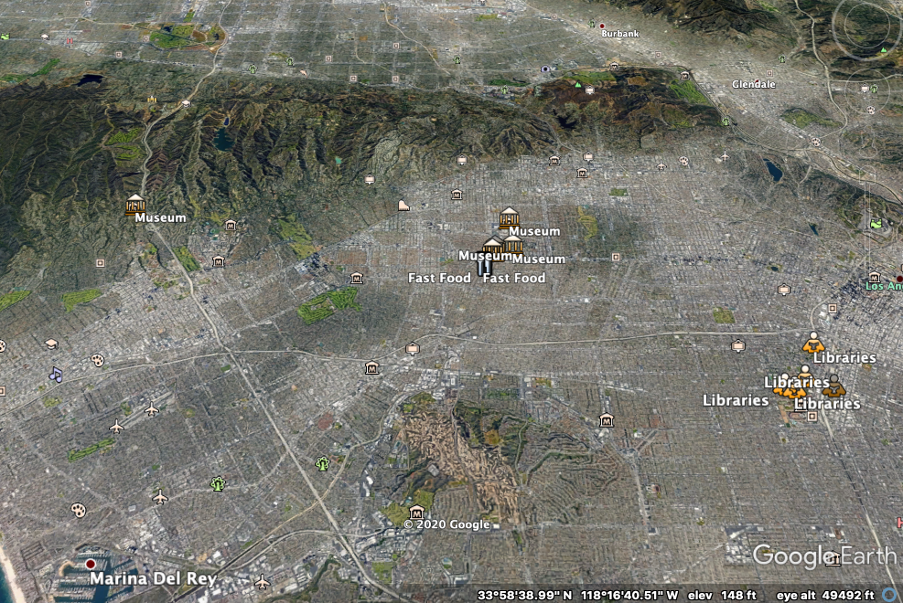
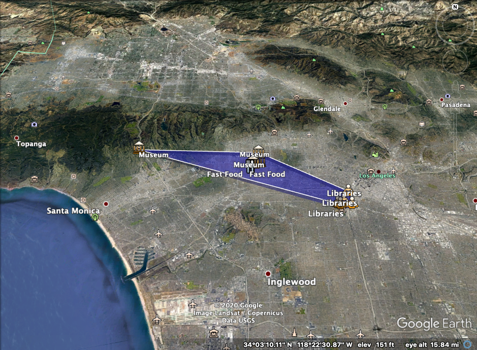
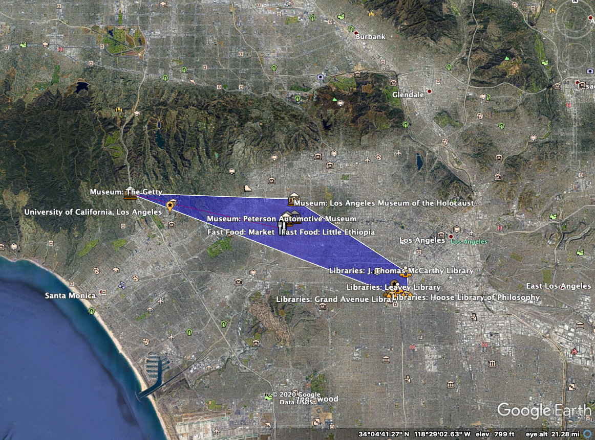
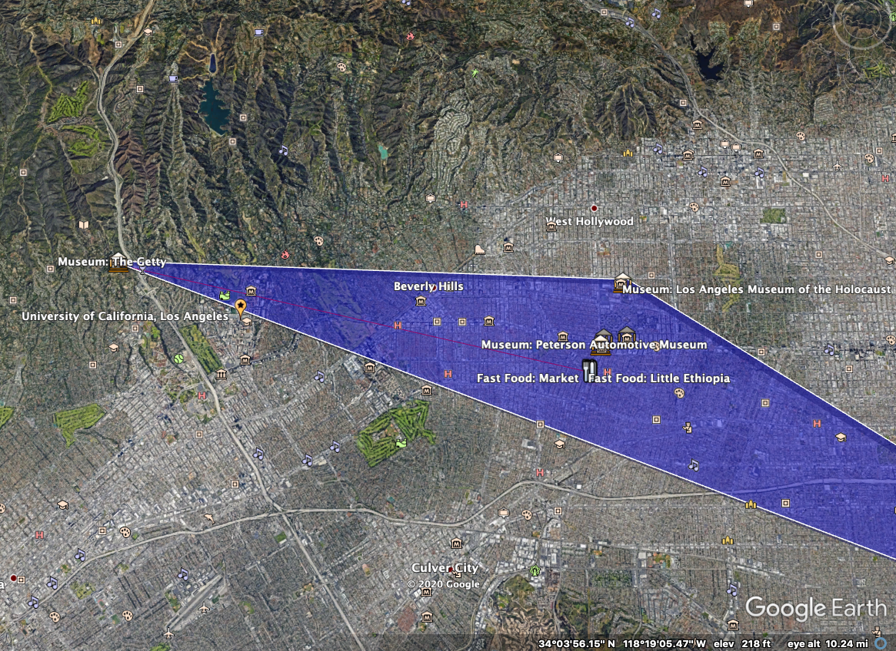
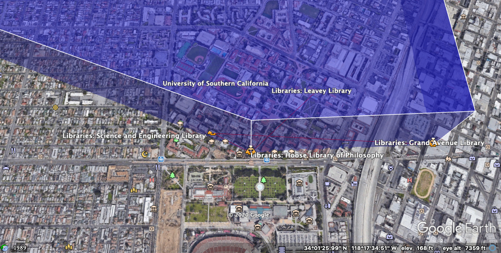

# GeoSpatial Data Handling

I followed up the USC assignment to understand Geospatial Data Handling. The assignment is from the University of Southern California Engineering course (CSCI 585: Database Systems).

Assignment Link:
http://bytes.usc.edu/cs585/s20_db0ds1ml2agi/hw/HW3/index.html

## PART 1: Collect Data Coordinates

Collected latitude,longitude pairs (ie. spatial coordinates) for 15 locations, which are near the USC campus.

Data Coordinates:

Fast Food:

1. Paradocs Coffee And Tea (34.057163, -118.364126)
2. Little Ethiopia (34.057035, -118.364565)
3. Lalibela (34.057426, -118.364533)
4. Market (34.057062, -118.364129)
5. E & M Cafe (34.057144, -118.363983)

Museum:

6. Academy Museum of Motion picture (34.063318, -118.360797)
7. Peterson Automotive Museum (34.062129, -118.361624)
8. The La Brea Tar Pits and Museum (34.063798, -118.355438)
9. Los Angeles Museum of the Holocaust (34.074531, -118.355719)
10. The Getty (34.078048, -118.474077)

Libraries:

11. Science and Engineering Library (34.019628, -118.288748)
12. Hoose Library of Philosophy (34.018698, -118.286600)
13. Leavey Library (34.021723, -118.282784)
14. Grand Avenue Library (34.019070, -118.276407)
15. J. Thomas McCarthy Library (34.031344, -118.276789)

Figure shows my 15 locations which are labeled nicely:


## PART 2: Create a KML file

KML File with 15 Coordinates: 
```
<?xml version="1.0" encoding="UTF-8"?>
<kml xmlns="http://earth.google.com/kml/2.0">
	<Document>
		<Style id="z1">
			<IconStyle><Icon><href>http://maps.google.com/mapfiles/kml/shapes/dining.png</href></Icon></IconStyle>
		</Style>
		<Style id="z2">
			<IconStyle><Icon><href>https://maps.google.com/mapfiles/kml/shapes/library_maps.png</href></Icon></IconStyle>
		</Style>
		<Style id="z3">
			<IconStyle><Icon><href>https://maps.google.com/mapfiles/kml/shapes/museum_maps.png</href></Icon></IconStyle>
		</Style>
		<Style id="z4">
			<IconStyle><Icon><href>http://maps.google.com/mapfiles/kml/paddle/orange-stars.png</href></Icon></IconStyle>
		</Style>

<Placemark>
  <styleUrl>#z1</styleUrl>
	<Point>
		<coordinates>-118.364126,34.057163</coordinates>
	</Point>
	</Placemark>
	<Placemark>
		<name>Fast Food: Little Ethiopia</name>
		<styleUrl>#z1</styleUrl>
		<Point>
			<coordinates>-118.364565,34.057035</coordinates>
		</Point>
	</Placemark>
	<Placemark>
		<name>Fast Food: Lalibela</name>
		<styleUrl>#z1</styleUrl>
		<Point>
			<coordinates>-118.364533,34.057426</coordinates>
		</Point>
	</Placemark>
	<Placemark>
		<name>Fast Food: Market</name>
		<styleUrl>#z1</styleUrl>
		<Point>
			<coordinates>-118.364129,34.057062</coordinates>
		</Point>
	</Placemark>
	<Placemark>
		<name>Fast Food: E and M Coffee</name>
		<styleUrl>#z1</styleUrl>
		<Point>
			<coordinates>-118.363983,34.057144</coordinates>
		</Point>
	</Placemark>
	<Placemark>
		<name>Museum: Academy Museum of Motion Picture</name>
		<styleUrl>#z3</styleUrl>
		<Point>
			<coordinates>-118.360797,34.063318</coordinates>
		</Point>
	</Placemark>
	<Placemark>
		<name>Museum: Peterson Automotive Museum</name>
		<styleUrl>#z3</styleUrl>
		<Point>
			<coordinates>-118.361624,34.062129</coordinates>
		</Point>
	</Placemark>
	<Placemark>
		<name>Museum: The La Brea Tar Pits and Museum</name>
		<styleUrl>#z3</styleUrl>
		<Point>
			<coordinates>-118.355438,34.063798</coordinates>
		</Point>
	</Placemark>
	<Placemark>
		<name>Museum: Los Angeles Museum of the Holocaust</name>
		<styleUrl>#z3</styleUrl>
		<Point>
			<coordinates>-118.355719,34.074531</coordinates>
		</Point>
	</Placemark>
	<Placemark>
		<name>Museum: The Getty</name>
		<styleUrl>#z3</styleUrl>
		<Point>
			<coordinates>-118.474077,34.078048</coordinates>
		</Point>
	</Placemark>
	<Placemark>
		<name>Libraries: Science and Engineering Library</name>
		<styleUrl>#z2</styleUrl>
		<Point>
			<coordinates>-118.288748,34.019628</coordinates>
		</Point>
	</Placemark>
	<Placemark>
		<name>Libraries: Hoose Library of Philosophy</name>
		<styleUrl>#z2</styleUrl>
		<Point>
			<coordinates>-118.286600,34.018698</coordinates>
		</Point>
	</Placemark>
	<Placemark>
		<name>Libraries: Leavey Library</name>
		<styleUrl>#z2</styleUrl>
		<Point>
			<coordinates>-118.282784,34.021723</coordinates>
		</Point>
	</Placemark>
	<Placemark>
		<name>Libraries: Grand Avenue Library</name>
		<styleUrl>#z2</styleUrl>
		<Point>
			<coordinates>-118.276407,34.019070</coordinates>
		</Point>
	</Placemark>
	<Placemark>
		<name>Libraries: J. Thomas McCarthy Library</name>
		<styleUrl>#z2</styleUrl>
		<Point>
			<coordinates>-118.276789,34.031344</coordinates>
		</Point>
	</Placemark>
	<Placemark>
		<name>University of California, Los Angeles</name>
		<styleUrl>#z4</styleUrl>
		<Point>
			<coordinates>-118.445200,34.068925</coordinates>
		</Point>
	</Placemark>
	<Placemark>
		<name>University of Southern California</name>
		<styleUrl>#z4</styleUrl>
		<Point>
			<coordinates>-118.285135,34.022345</coordinates>
		</Point>
	</Placemark>
</Document>
</kml>
```

Helpful links for part 2:

https://developers.google.com/kml/documentation/kml_tut#placemarks
http://bytes.usc.edu/cs585/s20_db0ds1ml2agi/hw/HW3/data/starter_kml.xml
https://developers.google.com/kml/documentation/kml_tut

KML Tutorial Link:
https://developers.google.com/kml/documentation/kml_tut#placemarks

## PART 3

Download Google Earth by following link:
https://www.google.com/earth/download/ge/agree.html

Load the .kml file in google earth.

OR

Just copy the .kml file below link instead of downloading google earth.
http://display-kml.appspot.com/


## PART 4

We need to run geospatial queries. I decided to use PostgreSQL with PostGIS extension on Amazon RDS (Amazon Relational Database Service) that way I do not need to install any softwares on my laptop. To setup Amazon RDS, I followed up following link:
https://aws.amazon.com/getting-started/tutorials/create-connect-postgresql-db/

* Just in case if you are using Terminal during setup. Use following code to install SQL Workbench:

```
file location path % sh /Applications/Workbench-Build125-with-optional-libs/sqlworkbench.sh
```

*Remeber your master username and password that you used to create Amazon RDS database.

While following the tutorial link, I got problem in step 4. My SQL was not connecting to the AWS. So, I watched the following Youtube video to troubleshoot the connection problem (Link here: https://www.youtube.com/watch?v=PxFZt8MG2ss). After that, I was able to setup the SQL Workbench to Amazon RDS console. 

## PART 5

I run the following queries on SQL Workbench GUI.

PostgresSQL Queries:
```
CREATE EXTENSION postgis;
CREATE TABLE geospatial(
location geometry
)
```

```
INSERT INTO geospatial (location)
VALUES
 ('point(34.057163 -118.364126)'),
 ('point(34.057035 -118.364565)'),
 ('point(34.057426 -118.364533)'),
 ('point(34.057062 -118.364129)'),
 ('point(34.057144 -118.363983)'),
 ('point(34.063318 -118.360797)'),
 ('point(34.062129 -118.361624)'),
 ('point(34.063798 -118.355438)'),
 ('point(34.074531 -118.355719)'),
 ('point(34.078048 -118.474077)'),
 ('point(34.019628 -118.288748)'),
 ('point(34.018698 -118.286600)'),
 ('point(34.021723 -118.282784)'),
 ('point(34.019070 -118.276407)'),
 ('point(34.031344 -118.276789)');
 ```
 
```
select ST_AsText(location) from geospatial;
```
 
#### To compute the Convex Hull
 
```
SELECT ST_AsText(ST_ConvexHull(ST_Collect(location)))
	FROM geospatial;
```

Result I got: 

POLYGON((
34.078048 -118.474077,
34.018698 -118.286600,
34.019070  -118.276407,
34.031344 -118.276789,
34.074531 -118.355719,
34.078048 -118.474077))

Then Update .kml file: (Paste below code in your .kml file)
```
<!-- Convex hull for all 15 points -->
	<Style id="transBluePoly">
      <LineStyle>
        <width>1.5</width>
      </LineStyle>
      <PolyStyle>
        <color>7dff0000</color>
      </PolyStyle>
    </Style>
  	<Placemark>
    <name>Convex Hull</name>
    <styleUrl>#transBluePoly</styleUrl>
    <Polygon>
      <extrude>1</extrude>
      <altitudeMode>relativeToGround</altitudeMode>
      <outerBoundaryIs>
        <LinearRing>
          <coordinates>
          	-118.474077,34.078048,500
  		    	-118.286600,34.018698,500
  			    -118.276407,34.019070,500
   			    -118.276789,34.031344,500
   			    -118.355719,34.074531,500
   			    -118.474077,34.078048,500
          </coordinates>
        </LinearRing>
      </outerBoundaryIs>
    </Polygon>
  </Placemark>
```

Sample:




To Learn more about the real life applications of convex hulls. Go to the link: https://www.quora.com/What-are-the-real-life-applications-of-convex-hulls

#### Compute the four nearest neighbors 

I chose UCLA coordinate to compute its four nearest neighbours of my 15 locations.
University of California, Los Angeles
Los Angeles, CA 90095
(34.068925, -118.445200)

Four Nearest Neighor from UCLA are:

1. The Getty
2. Lalibela (34.057426, -118.364533)
2. Paradocs Coffee And Tea (34.057163, -118.364126)
3. Little Ethiopia (34.057035, -118.364565)

Query:
```
SELECT ST_Distance(location, 'POINT(34.068925 -118.445200)'::geometry) AS d, ST_AsText(location)
FROM geospatial
ORDER BY d ASC limit 4;
```

Then Update the .kml file:
```
<!-- Four Nearest neighbor from UCLA -->
<Placemark>
  	<name>Four Nearest Neighbor: UCLA</name>
  	<Style>
  	<LineStyle>  
   	<color>#ff0000ff</color>
  	</LineStyle> 
 	  </Style>
   	<LineString>
          <coordinates>
          	-118.474077,34.078048,600
			      -118.364533,34.057426,600
			      -118.364565,34.057035,600
			      -118.364126,34.057163,600
          </coordinates>
    </LineString>
</Placemark>
```



Let's Check USC too,

University of Southern California
Los Angeles, CA 90007
(34.022345, -118.285135)

Four Nearest Neighor from UCLA are:
1. Science and Engineering Library (34.019628, -118.288748)
2. Hoose Library of Philosophy (34.018698, -118.286600)
3. Leavey Library (34.021723, -118.282784)
4. Grand Avenue Library (34.019070, -118.276407)

Query:
```
SELECT ST_Distance(location, 'POINT(34.022345 -118.285135)'::geometry) AS d, ST_AsText(location)
FROM geospatial
ORDER BY d ASC limit 4;
```

.kml file:
```
<!-- Four Nearest neighbour from USC -->
<Placemark>
	  <name>Four Nearest Neighbor: USC</name>
  	<Style>
  	<LineStyle>  
   	<color>#ff0000ff</color>
  	</LineStyle> 
 	  </Style>
   	<LineString>
         <coordinates>
          	-118.282784,34.021723,600 
			      -118.286600,34.018698,600
			      -118.288748,34.019628,600
		      	-118.276407,34.019070,600
         </coordinates>
    </LineString>
</Placemark>
```



Helpful Reference for writing k-nearest neighbour query:
https://postgis.net/docs/geometry_distance_knn.html


Other Helpful Links:-

Google Maps Icons:
http://kml4earth.appspot.com/icons.html


